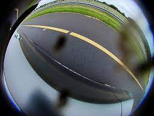
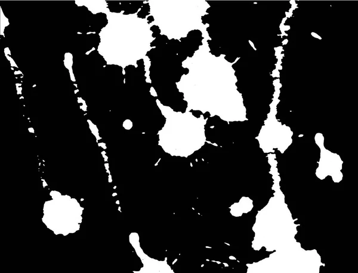

# Utilization of GAN to enhance degraded images

In this documentation I am going to indicate my studies on using GAN to enhance the degraded images.

The scenario is that we have an input image and we should enhance its quality.

The input image can loose its quality due to reasons like rain, drop mud, and so on. Since gathering such a dataset is not trivial, we need to use GAN to produce this kind of images:




In order to produce such a dataset, the [dirtygan](https://openaccess.thecvf.com/content/WACV2021/papers/Uricar_Lets_Get_Dirty_GAN_Based_Data_Augmentation_for_Camera_Lens_WACV_2021_paper.pdf) article were studied.

In this article the `Woodscape` dataset were used. The problem with this dataset is that it has the images of streets and so called `out door` environment.

But we need the Images of `In door` environment.

Some In door datasets that were find are:

Key indoor image enhancement datasets:

1. LOL (Low-Light) Dataset
- 500 low/normal light image pairs
- Real indoor scenes
- Focus on lighting enhancement

2. SICE Dataset
- Multi-exposure indoor/outdoor images
- 589 multi-exposure sequences
- Good for HDR enhancement

3. MIT-Adobe FiveK
- 5000 RAW photos with expert retouching
- Contains indoor subset
- Multiple enhancement aspects

4. DPED (DSLR Photo Enhancement Dataset)
- Smartphone vs DSLR quality pairs
- Includes indoor scenes
- Focus on overall quality enhancement

5. Real-World Super-Resolution
- Indoor image pairs at different resolutions
- Focus on upscaling quality
- Natural degradation patterns


we can use a combination of above dataset to make our owns. 

The next step is to train a GAN. Since we will have paired images, the `CycleGAN` or `pix2pix` is a good choice to achieve what we want. 

We should have two sets of images A: original images, and B:dirty images.

The proposed method is to train the Generative model on the images of mentioned article to initialize the weights and then use the in door images.

This method can be challenging. An alternate method is to degraded some images using image processing techniques ourselves. 

and then use those images to train the Generator and Discriminator. but we should consider there can be different kinds of degradation such as rain drop or mud drop. 

If we want to use image processing, we can define a binary mask and then add that mask to our original image, the sudo code would be:

```
degraded_image = original_image + coef * mask
```

An advantage of this method is that we can determine the `coef` between 0 and 1, so that we can degrade with different levels.

The mask should be an image like the following:



These kind of masks can be created using `Open-CV` or other tools.

once we create our mask, we can add it, with a coefficient to our original image. 

Then we can train our GAN.
